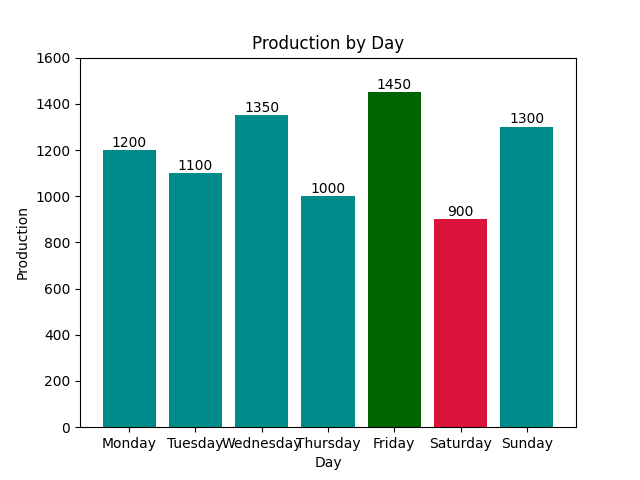
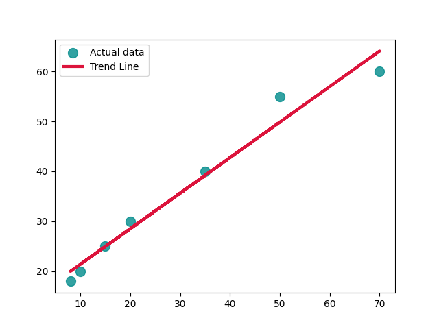

# Manufacturing Production Analysis

## Project Overview
This project analyzes daily manufacturing production data, including production output, defects, and downtime, using Python and data visualization techniques to identify patterns and relationships between variables.

## Dataset
The dataset contains daily manufacturing production data, including production output, defect counts, and downtime minutes. Each row represents one production day and is used to analyze operational performance and relationships between manufacturing variables.

### Dataset Columns
- **Day**: production day
- **Production**: total units produced
- **Defects**: number of defects recorded
- **Downtime_Minutes**: downtime duration in minutes

## Tools Used
- **Python**: core programming language
- **Pandas**: data analysis and manipulation
- **Matplotlib**: data visualization
- **NumPy**: numerical calculations and trend line analysis

## Visualizations
The project includes visual analysis using bar charts and scatter plots to compare manufacturing variables and identify relationships between production metrics.

### Visual Analysis
- **Bar charts**: used to compare daily production output and defect counts.
- **Scatter plot with trend line**: used to analyze the relationship between downtime and defects and identify positive correlation patterns.

### Production by Day

### Defects vs Downtime

## Key Findings
- **Highest production** was recorded on **Friday** with **1450 units**, while the **lowest production** occurred on **Saturday** with **900 units**.
- **Friday** recorded the **lowest number of defects** with **18**, while **Saturday** had the **highest defect count** with **60**.
- A **positive relationship** was observed between **Downtime_Minutes** and **Defects**, suggesting that higher downtime tends to be associated with higher defect counts.

## Future Improvements
- Expand the dataset to include additional production variables and longer time periods.
- Apply correlation analysis and statistical techniques for deeper insights.
- Improve visualizations with additional comparisons and reporting features.
- Explore predictive analysis and machine learning applications in future versions.