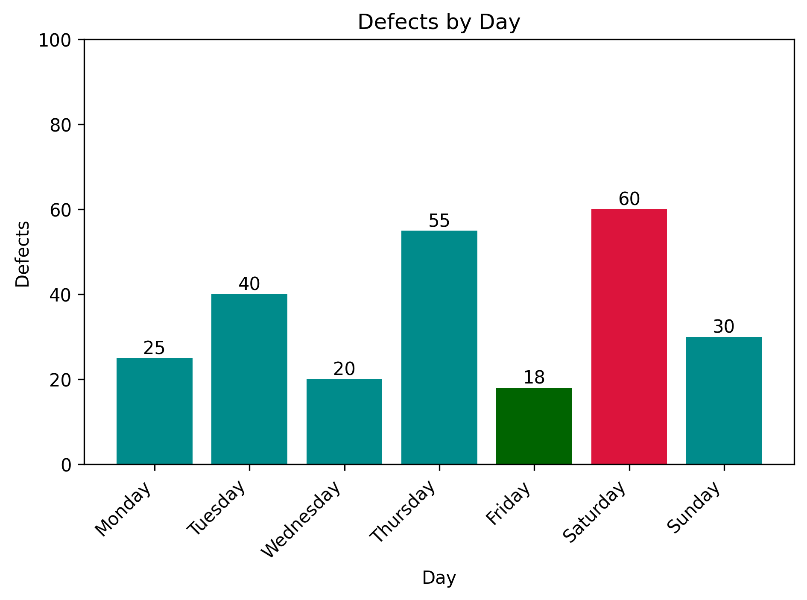

# Manufacturing Production Analysis


## Project Overview

This project analyzes a small manufacturing production dataset using Python. The goal is to identify production patterns, defect trends, downtime behavior, and possible relationships between operational variables.

The analysis focuses on answering practical business questions such as:

* Which day had the highest production?
* Which day had the lowest production?
* Which day had the most defects?
* Is there a relationship between downtime and defects?
* Which operational patterns may be worth investigating?

This project is part of my learning path toward Data Analyst and Business Intelligence roles.

## Dataset

The dataset contains daily manufacturing data with the following columns:

| Column             | Description                        |
| ------------------ | ---------------------------------- |
| `Day`              | Day of the week                    |
| `Production`       | Number of units produced           |
| `Defects`          | Number of defective units recorded |
| `Downtime_Minutes` | Downtime in minutes                |

## Tools Used

* **Python**: core programming language
* **Pandas**: data analysis and manipulation
* **Matplotlib**: data visualization
* **NumPy**: numerical calculations and trend line analysis

## Analysis Process

The analysis was performed using the following steps:

1. Load the dataset with Pandas.
2. Explore the data structure.
3. Calculate key statistical metrics.
4. Identify maximum, minimum, and average values.
5. Create visualizations using Matplotlib.
6. Analyze the relationship between downtime and defects.
7. Generate business-oriented insights.

## Visualizations

The project includes visual analysis using bar charts and a scatter plot to compare manufacturing variables, identify daily performance patterns, and analyze relationships between production metrics.

### Visual Analysis

* **Production by Day**: compares daily production output and highlights the highest and lowest production days.
* **Defects by Day**: compares daily defect counts and helps identify days with higher quality issues.
* **Defects vs Downtime**: analyzes the relationship between downtime and defects using a scatter plot with a trend line.

### Production by Day

This chart shows daily production levels and helps identify which day had the highest and lowest production output.


### Defects by Day

This chart shows the number of defects recorded each day. It helps identify which days had higher quality issues.



### Defects vs Downtime

This scatter plot shows the relationship between downtime minutes and number of defects. The trend line suggests a strong positive relationship between downtime and defects.


## Key Statistical Findings

The dataset shows an average daily production of **1,185.71 units**, with a minimum of **900** and a maximum of **1,450 units**. The standard deviation of **182.67** indicates a noticeable variation in daily production levels across the week.

Defects averaged **35.43 per day**, ranging from **18** to **60 defects**. The standard deviation of **15.53** shows that defect counts varied significantly between production days.

Downtime averaged **29.71 minutes per day**, with a minimum of **8 minutes** and a maximum of **70 minutes**. The standard deviation of **21.49 minutes** indicates that downtime was not consistent across the dataset.

The correlation between **Defects** and **Downtime_Minutes** was **0.98**, indicating a very strong positive relationship. This suggests that days with higher downtime tend to be associated with higher defect counts.

## Key Findings

* **Highest production** was recorded on **Friday** with **1,450 units**.
* **Lowest production** occurred on **Saturday** with **900 units**.
* **Friday** recorded the **lowest number of defects** with **18 defects**.
* **Saturday** had the **highest defect count** with **60 defects**.
* The combination of **low production** and **high defects** on Saturday may indicate an operational issue worth investigating.
* A **strong positive relationship** was observed between **Downtime_Minutes** and **Defects**, suggesting that higher downtime tends to be associated with higher defect counts.

## How to Run

Clone the repository and run the Python script:

```bash
python main.py
```

Make sure the dataset is located inside the `data/` folder and the generated charts are saved inside the `images/` folder.

## Project Structure

```text
manufacturing-production-analysis/
├── data/
│   └── production_data.csv
├── images/
│   ├── production_by_day.png
│   ├── defects_by_day.png
│   └── defects_vs_downtime.png
├── main.py
└── README.md
```

## Future Improvements

* Expand the dataset to include additional production variables and longer time periods.
* Compare production performance by shifts, machines, operators, or product categories.
* Improve visualizations with additional comparisons and reporting features.
* Explore predictive analysis and machine learning applications in future versions.
